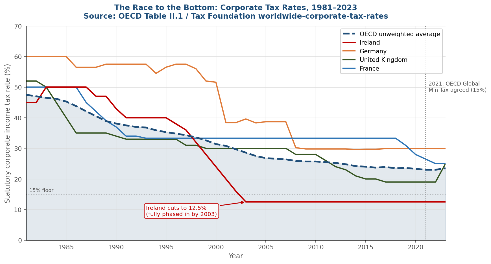
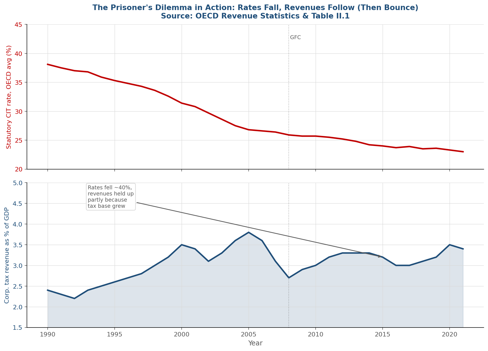
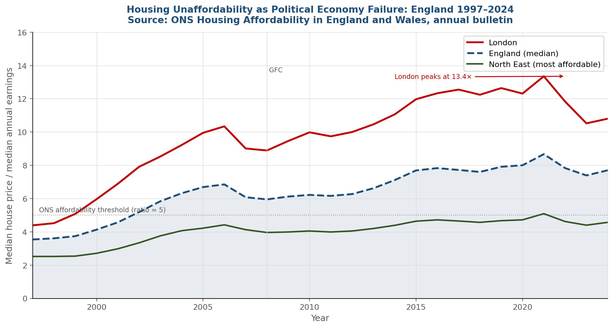
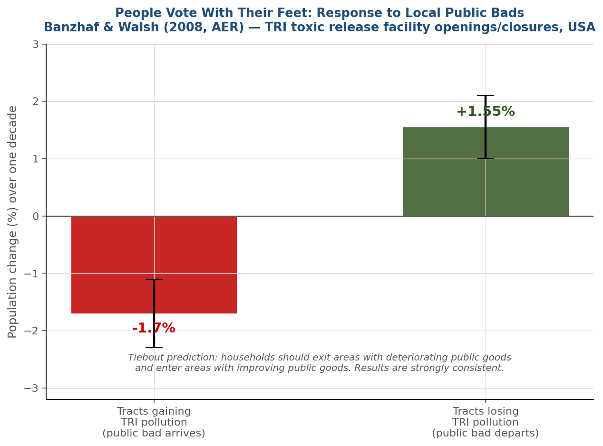
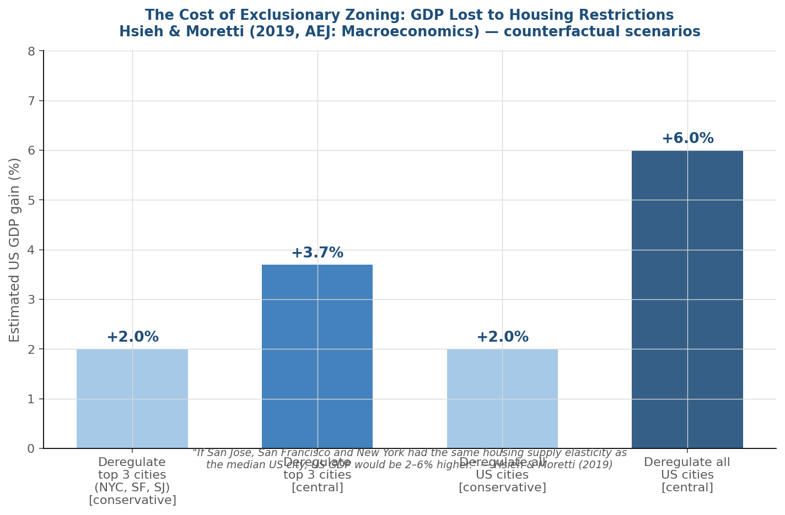

## Roadmap {.center}

::: {.columns}
::: {.column width="55%"}

1. The public goods problem
2. Tiebout's elegant answer
3. Where it breaks down
4. Real evidence: the EU tax competition laboratory
5. Political economy: who actually decides?

:::
::: {.column width="45%"}

::: {.callout-note appearance="simple"}

The city is not just geography , it is a strategic game played by households, firms, and governments.
:::

:::
:::

# Part 1: Why Asking Nicely Doesn't Work {.section-slide}

## The Free-Rider Problem{.smaller}

::: {.columns}
::: {.column width="55%"}

**The scenario**

A city council wants to build a park. They ask residents:

> *"How much would you pay for this park?"*

**The problem:** since the park is free for everyone once built, a rational resident has every incentive to **understate** their true willingness to pay.

*"Let someone else pay, I'll enjoy it anyway."*

This is the **free-rider problem** , the central obstacle in the economics of public goods.

:::
::: {.column width="45%"}

::: {.callout-important appearance="minimal"}
**What makes a good "public"?**

**Non-excludable** , once provided, you cannot stop anyone from using it

**Non-rival** , your use does not reduce mine

Examples: street lighting, national defence, clean air, a park
:::

:::
:::


## The Samuelson Condition

::: {.columns}
::: {.column width="60%"}

[Paul Samuelson (1954)](https://www.jstor.org/stable/1925895) proved the efficiency condition:

$$\sum_{i=1}^{n} MRS_i = MRT$$

**In plain English:** the sum of all individuals' marginal willingness to pay must equal the marginal cost of providing the good.

::: {.fragment}
**The catch:** the government does not know individual $MRS_i$.

Asking people to report them is a game they will **systematically lose** , the dominant strategy is to underreport.
:::

:::
::: {.column width="40%"}

::: {.callout-tip appearance="simple"}
**Samuelson (1954)**

*"The pure theory of public expenditure"*

Review of Economics and Statistics

No decentralised pricing system can achieve efficient provision of pure public goods.
:::

:::
:::


## The Mechanism Design Solution

::: {.columns}
::: {.column width="55%"}

[Clarke (1971)](https://www.jstor.org/stable/30022651) and [Groves (1973)](https://www.jstor.org/stable/1914085) developed the **pivotal mechanism**:

Each agent pays a "tax" equal to the **harm they impose on others** by their vote.

→ Truth-telling becomes a **dominant strategy**

::: {.fragment}
**Does this sound familiar?**

It should , the **Clarke–Groves–Vickrey (VCG) mechanism** is the same logic as the **second-price (Vickrey) auction**, generalised to public goods.

The city public goods problem *is* an auction design problem.
:::

:::
::: {.column width="45%"}

::: {.callout-note appearance="simple"}
**The VCG connection**

In a second-price auction, you pay the second-highest bid = the externality you impose on others.

Truth-telling is dominant because your payment does not depend on your own report.

Same structure in the pivotal mechanism for public goods.
:::

:::
:::
## Clarke Mechanism , Numerical Example

Three individuals (A, B, C) decide whether to build a **bridge** costing **300**.

| Person | Personal Value |
|--------|---------------|
| A      | 150           |
| B      | 120           |
| C      | 80            |

Total declared benefit = **350 > 300** $\Rightarrow$ Bridge is built.

. . .

::::{.columns}
:::{.column width=50%}

**Clarke tax:** each pays the "damage" imposed on others.

| Person | Others' total | Pivotal? | Tax |
|--------|---------------|----------|-----|
| A      | 200           | Yes      | 100 |
| B      | 230           | Yes      | 70  |
| C      | 270           | Yes      | 30  |

A's surplus: $150 - 100 = 50 > 0$ ✓

:::
:::{.column width=50%}

**What if A lies?** (true value = 150)

<div style="font-size: 85%;">

*Understates* ($v_A = 50$):

- Total = $250 < 300$ → bridge **not built**
- A gets 0, lost a surplus of 50 ✗

*Overstates* ($v_A = 200$):

- Bridge built, tax still = 100
- But if true value were 80: surplus = $80 - 100 = -20$ ✗

</div>

:::
::::

. . .

**Why is honesty optimal?** Your tax depends on *others'* reports, not yours. Your report only affects the **decision**: the only way to get the right decision *for you* is to tell the truth. $\Rightarrow$ **Dominant strategy: truthful revelation.**


---

# Part 2: Shop Around for Your Government {.section-slide}

## Tiebout (1956): The Core Insight

::: {.columns}
::: {.column width="55%"}

Charles [Tiebout's 1956](https://www.jstor.org/stable/1826343) paper proposed a beautiful solution that **bypasses** the preference revelation problem entirely.

**The insight:** if there are many local governments, each offering a different bundle of taxes and public services, households will naturally sort themselves by **choosing where to live**.

Location choice *reveals* preferences , no asking required.

::: {.callout-tip appearance="simple"}
Tiebout, C. (1956). A pure theory of local expenditures. *Journal of Political Economy*, 64(5), 416–424.
:::

:::
::: {.column width="45%"}

::: {.callout-note appearance="minimal"}
**The apple-and-orange analogy 🍎🍊**

Imagine two market stalls side by side:
one sells apples, one sells oranges.

Apple-lovers go to the apple stall. Orange-lovers go to the orange stall. Nobody is forced to buy what they do not want.

Tiebout says local governments are like these stalls. If there are enough of them, households self-sort into their preferred "stall".
:::

:::
:::


## Tiebout as a Mechanism Design Result

::: {.columns}
::: {.column width="60%"}

Under Tiebout's assumptions, **mobility substitutes for costly truth-telling**:

| Samuelson's world | Tiebout's world |
|---|---|
| Ask people what they want | Let them vote with their feet |
| Strategic misreporting | Location choice reveals truth |
| Centralised optimum hard to find | Decentralised sorting achieves it |

::: {.fragment}
**Under full assumptions** (perfect mobility, full information, many jurisdictions, no spillovers, no economies of scale) → **Pareto-efficient** provision of local public goods.
:::

:::
::: {.column width="40%"}

::: {.callout-important appearance="minimal"}
**The empirical question**

Does Tiebout sorting actually happen?

**Yes, partially:**

- [Oates (1969)](https://www.journals.uchicago.edu/doi/abs/10.1086/259584): school quality capitalised into house prices 
- [Banzhaf & Walsh (2008)](https://www.jstor.org/stable/29730097): households move away from pollution, and increased density in areas with improving public goods.

**But with limits:**

- [Rhode & Strumpf (2003)](https://www.jstor.org/stable/3132146): US municipalities became *less* heterogeneous over time, contrary to prediction
:::

:::
:::

# Part 3: And Then Reality Showed Up {.section-slide}

## Four Failures of the Tiebout Model

::: {.columns}
::: {.column width="50%"}

**1. Moving is costly**

Real households cannot costlessly switch jurisdictions. Homeowners especially face: transaction costs, attachment to community, school disruption, job constraints.

*Unlike our apple buyer, most residents are largely stuck.*

**[Fischel (2001)](https://www.jstor.org/stable/3146859):** The "Homevoter Hypothesis": homeowners systematically oppose policies that might lower property values, distorting the sorting mechanism.

:::
::: {.column width="50%"}

**2. Fiscal externalities**

What Town A does affects Town B.

*Like an apple vendor whose fermented apples smell up the entire market.*

Town A accepts a polluting factory → Town B bears the pollution costs. Town A does not count these when deciding.

→ Individually rational decisions are **collectively inefficient**

:::
:::


## The Race to the Bottom , A Prisoner's Dilemma

::: {.columns}
::: {.column width="55%"}

When capital is mobile, jurisdictions compete for it by cutting taxes.

|  | **B: High tax** | **B: Low tax** |
|---|---|---|
| **A: High tax** | Both fund good services | B gains firms; A loses |
| **A: Low tax** | A gains firms; B loses | Both lose revenue  |

::: {.fragment}
This is a classic **Prisoner's Dilemma**:

- Dominant strategy for each jurisdiction: **cut taxes**
- Nash equilibrium: both cut
- Equilibrium is **Pareto inferior** to full cooperation

**[Zodrow & Mieszkowski (1986)](https://www.sciencedirect.com/science/article/abs/pii/0094119086900483):** formalised this , tax competition leads to **underprovision of local public goods**.
:::

:::
::: {.column width="45%"}

::: {.callout-important appearance="minimal" .fragment}
**The fourth failure: stratification**

Tiebout sorting is not just inefficient , it is **inequitable**.

Rich jurisdictions → high tax base → good schools

Poor jurisdictions → low tax base → poor services

**[Epple & Romer (1991)](https://www.jstor.org/stable/2937782):** income stratification across jurisdictions is an *equilibrium outcome* of Tiebout sorting.

**[Chetty, Hendren & Katz (2016)](https://www.aeaweb.org/articles?id=10.1257/aer.20150572):** moving to a higher-income neighbourhood has large positive causal effects on children's long-run earnings.
:::

:::
:::

# Part 4: How to Steal a Tax Base (:unamused: :ireland:) {.section-slide}

## The Race to the Bottom , It Actually Happened

```{=html}
<div style="text-align:center;">
  
</div>
```

::: {style="font-size:0.72em; color:#595959; text-align:center; margin-top:6px;"}
Source: OECD Table II.1 / Tax Foundation *Worldwide Corporate Tax Rates* dataset. All statutory rates.
:::


## Ireland: Defecting from the Cooperative Equilibrium

::: {.columns}
::: {.column width="58%"}

**The strategy:** Ireland cut its corporate tax rate to **12.5%** while EU partners maintained 25–40%.

**The payoff:**
- Apple, Google, Facebook, LinkedIn → European HQs in Dublin
- Ireland's GDP per capita grew from ~70% of EU average in 1990 to ~200% by 2019

**The externality:**
- Other EU member states lost tax base
- Competitive pressure on all EU countries to cut their own rates

::: {.fragment}
**The legal response:**
European Commission (2016), State Aid Case SA.38373 → ruled Apple's Irish arrangements illegal state aid, ordered **€13 billion** in back taxes.
:::

:::
::: {.column width="42%"}

::: {.callout-note appearance="minimal"}
**[Devereux, Lockwood & Redoano (2008)](https://www.sciencedirect.com/science/article/abs/pii/S0047272707001351)**

*Journal of Public Economics* 92(5–6)

Studied OECD countries over several decades.

**Finding:** a country is significantly more likely to cut its statutory corporate rate in response to **rate cuts by neighbours**.

→ Countries are playing a **repeated game** and the equilibrium involves rates below what a global social planner would choose.
:::

:::
:::


## Rates vs. Revenues: The Full Picture

```{=html}
<div style="text-align:center;">
  
</div>
```

::: {style="font-size:0.72em; color:#595959; text-align:center; margin-top:4px;"}
Source: OECD Revenue Statistics (Table 1200) & Table II.1. Rates fell ~40%; revenues held up partially because the tax base broadened.
:::


## Escaping the Prisoner's Dilemma

::: {.columns}
::: {.column width="60%"}

**The 2021 OECD/G20 Global Minimum Tax (Pillar Two)**

Over 140 countries agreed to a **15% floor** on corporate taxation for multinationals with revenue > €750m.

**Game-theoretic reading:**

This is an attempt to move from the defection equilibrium to the cooperative equilibrium by **binding commitment**, the same logic as a cartel agreement maintaining price above competitive level, but in reverse.

By making defection below 15% irrational (no gains, the other country collects the top-up), the agreement stabilises a higher-tax equilibrium.

:::
::: {.column width="40%"}

::: {.callout-tip appearance="minimal"}
**The folk theorem connection**

In a repeated prisoner's dilemma, cooperation can be sustained as a Nash equilibrium if players are sufficiently patient (discount factor $\delta$ high enough).

International tax coordination is the institutional mechanism that makes commitments credible, substituting for the infinitely-repeated game logic.
:::

:::
:::

# Part 5: The Median Voter Has a Mortgage {.section-slide}

## The Median Voter Theorem

::: {.columns}
::: {.column width="60%"}

**Classical result** ([Hotelling 1929](https://www.jstor.org/stable/2224214); [Black 1948](https://www.jstor.org/stable/1825026); [Downs 1957](https://www.jstor.org/stable/1827369)):

In a majority vote over a **single policy dimension**, the preferred outcome of the **median voter** wins.

Applied to local public goods: the level of school spending, park maintenance, or zoning in a municipality reflects the preference of the **median resident**.

::: {.fragment}
**Evidence:** [Bergstrom & Goodman (1973)](https://www.jstor.org/stable/1914361), strong support for median voter determination of local government spending in US municipalities.

**Important caveat:** [Romer & Rosenthal (1979)](https://www.jstor.org/stable/1884470), agenda-setting power of bureaucrats can shift outcomes away from the median voter's ideal point.
:::

:::
::: {.column width="40%"}

::: {.callout-note appearance="minimal"}
**The geometry**

```{r, engine='tikz'}
\begin{tikzpicture}
  \draw[] plot[domain=0:5, samples=100, smooth]
    (\x, {2*exp(-(\x-2.5)^2/(2*1^2)) / (1*sqrt(2*pi))});
  \draw[|-|,thick] (0,0)node[left]{Preferences:} -- node[midway, circle, fill=black, inner sep=1pt]{}node[midway,below]{Median voter}(5,0)node[]{};
\end{tikzpicture}
```

Single-peaked preferences + majority voting → median voter's ideal point is the Condorcet winner.

Works cleanly in one dimension. Breaks down with multi-dimensional policy spaces (Arrow's impossibility theorem lurks nearby).
:::

:::
:::


## Homeowners as Median Voters , and the Exclusion Problem

::: {.columns}
::: {.column width="55%"}

**Fischel's Homevoter Hypothesis (2001)**

In suburban US municipalities, homeowners are the decisive median voters. Their primary asset is their house.

→ They vote to **protect property values**

→ They systematically oppose zoning that allows apartments, social housing, or higher density

→ Result: **exclusionary zoning**

::: {.fragment}
**[Hilber & Vermeulen (2016)](https://www.jstor.org/stable/24738168):**

Regulatory constraints, driven by existing homeowner political influence, are the **primary driver of housing undersupply** in England, more important than physical geography.

*"South East house prices would have been ~25% lower in 2008 if planning regulations had been as permissive as in the North East."*
:::

:::
::: {.column width="45%"}

```{=html}
<div style="text-align:center;">
  
</div>
```

::: {style="font-size:0.68em; color:#595959; text-align:center;"}
Source: ONS Housing Affordability in England and Wales, annual bulletin
:::

:::
:::


## People Actually Vote With Their Feet

```{=html}
<div style="text-align:center;">
  
</div>
```

::: {style="font-size:0.72em; color:#595959; text-align:center; margin-top:4px;"}
[Banzhaf & Walsh (2008)](https://www.aeaweb.org/articles?id=10.1257/aer.98.3.843) , TRI toxic release facility openings/closures across US communities.
Tiebout's mechanism confirmed: households exit areas with deteriorating public goods, enter areas with improving ones.
:::


## Zoning as an Incomplete Contract

::: {.columns}
::: {.column width="58%"}

**Contract theory reading of zoning**

Zoning rules are an **incomplete contract** between the city and residents/developers.

Like all incomplete contracts: impossible to specify all future contingencies in advance.

**Residual control rights** (what happens in unspecified circumstances) are allocated **politically**.

→ Existing homeowners use political power to write residual rights in their favour

→ They capture **regulatory rent**

:::
::: {.column width="42%"}

```{=html}
<div style="text-align:center;">
  
</div>
```

::: {style="font-size:0.68em; color:#595959; text-align:center;"}
[Hsieh & Moretti (2019)](https://www.aeaweb.org/articles?id=10.1257/mac.20170388)
:::

::: {.callout-important appearance="minimal" style="font-size:0.78em;"}
**[Glaeser & Gyourko (2003)](https://www.nber.org/papers/w8835):** in many US/EU cities, house prices exceed construction costs by 50%+. The wedge = value of the regulatory permit, monopolised through the political process.
:::

:::
:::


---

# Conclusion {.section-slide}


## Bringing It All Together

::: {.columns}
::: {.column width="50%"}

**What we covered**

The economics of local public goods is a story about **information and incentives** , the same themes running through mechanism design, auction theory, and contract theory.

| Problem | Framework |
|---|---|
| Preference revelation | VCG / mechanism design |
| Tiebout sorting | Market mechanism |
| Tax competition | Prisoner's dilemma |
| Median voter bias | Political economy |
| Zoning restrictions | Incomplete contracts |

:::
::: {.column width="50%"}

**Why it matters beyond theory**

::: {.incremental}
- Housing is unaffordable in **Prague, Lisbon, and London** because (at least partially) existing homeowners control zoning: a political economy failure
- **Ireland** built a tech cluster by defecting from high-tax cooperation a prisoner's dilemma in action
- **140+ countries** needed a multi-year negotiation to stop racing each other to the bottom escaping Nash through coordination
- **Families in poor neighbourhoods** face compounding disadvantage , Tiebout sorting entrenches inequality
:::

:::
:::


## Questions to take home and reflect upon

1. The Tiebout model assumes **no economies of scale** in public good provision. How does this assumption interact with city size? Can a city be "too small" for efficient Tiebout sorting?

3. The median voter theorem predicts that **homeowners** dominate suburban zoning decisions. In the Czech Republic and Portugal, where homeownership rates are high (above 70%), what does this predict for housing supply over the next decade? What extra role would public housing play in this context?

4. The VCG mechanism solves the public goods revelation problem in **theory**. Why is it almost never used in practice? What implementation problems arise?

## {.center .end-slide}

::: {style="text-align:center; padding: 60px 0;"}

### Thank you

**BIP Planning and Economics of Cities**

Prague University of Economics and Business | March 2026

::: {style="margin-top:30px; font-size:0.85em; color:#595959;"}
*"The city is not just geography , it is a strategic game played by households, firms, and governments."*
:::

:::
